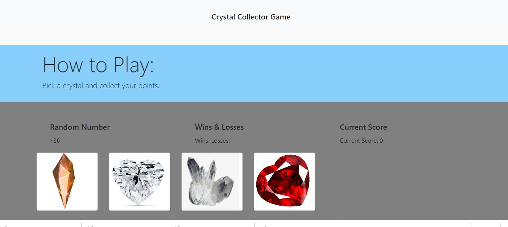

# Crystals Collector Game

## Description
jQuery, a JavaScript library was created to simplify DOM manipulation and event handling. To simplify the workflow jQuery syntax is used thus using fewer lines of code to accomplish the same task. The jQuery library is still widely used in both new and legacy code. 
